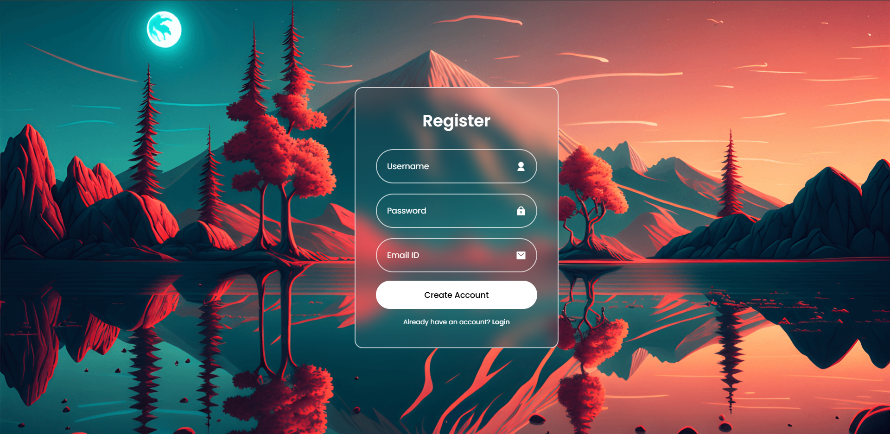

Absolutely! Below is a complete and professional `README.md` tailored for your project: **“A Multi-Tier Microservices Architecture for User Authentication Using Docker Compose”**.

---

## 📄 `README.md`

```markdown
# 🚀 Dockerized User Authentication System

A **multi-tier microservices architecture** for user registration and login using **Flask**, **MySQL**, and **phpMyAdmin**, fully containerized with **Docker Compose**.

This project demonstrates how to build a scalable, secure, and responsive user authentication system using microservices, ideal for deployment on cloud platforms like AWS EC2.

---

## 📌 Features

- ✅ Flask-based backend for user registration & login
- ✅ MySQL database for secure data storage
- ✅ phpMyAdmin for visual DB management
- ✅ Glassmorphism UI with custom fonts & dark mode
- ✅ Fully containerized with Docker & Docker Compose
- ✅ Responsive layout for mobile and desktop
- ✅ Deployed on Ubuntu EC2 instance

---

## 🛠️ Tech Stack

| Layer        | Technology               |
|--------------|---------------------------|
| Frontend     | HTML, CSS, Remix Icons    |
| Backend      | Python (Flask)            |
| Database     | MySQL                     |
| Admin Panel  | phpMyAdmin                |
| Containerization | Docker, Docker Compose |

---

## 🗂️ Project Structure

```

login-project/
├── app/
│   ├── app.py
│   ├── templates/
│   │   ├── login.html
│   │   ├── register.html
│   │   └── welcome.html
│   └── static/
│       └── images/
│           └── login-bg.png
├── Dockerfile
├── docker-compose.yml
├── requirements.txt
└── README.md

````

---

## 🚀 Getting Started

### 🔧 Prerequisites

- Docker installed
- Docker Compose installed

### 🔨 Build and Run

```bash
git clone https://github.com/your-username/docker-login-project.git
cd docker-login-project
docker-compose up --build
````

> Access the app at: `http://localhost:5000`
> Access phpMyAdmin at: `http://localhost:9090`

---

## 💾 MySQL Setup

Run this SQL once inside phpMyAdmin:

```sql
CREATE TABLE users (
  id INT AUTO_INCREMENT PRIMARY KEY,
  username VARCHAR(255) NOT NULL,
  password VARCHAR(255) NOT NULL,
  email VARCHAR(255) NOT NULL
);
```
## 📸 Screenshots

### 🔐 Login Page


### 📝 Registration Page


### 📝 Welcome Page

